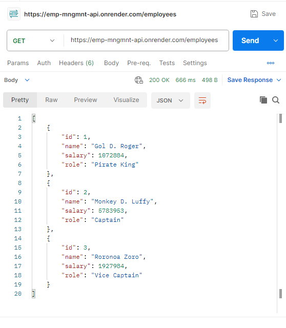
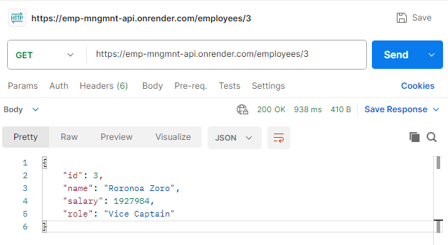
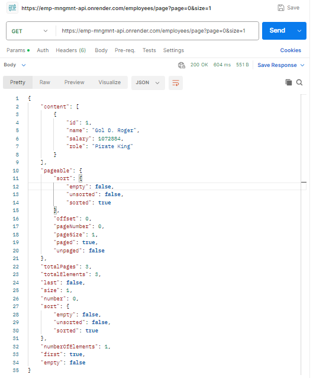
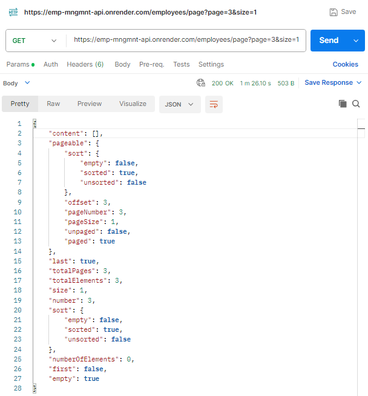
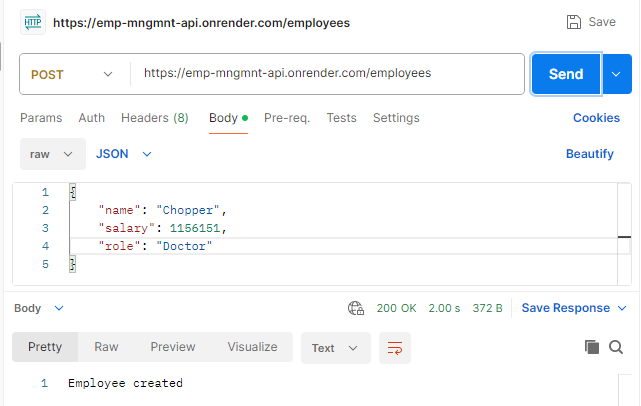
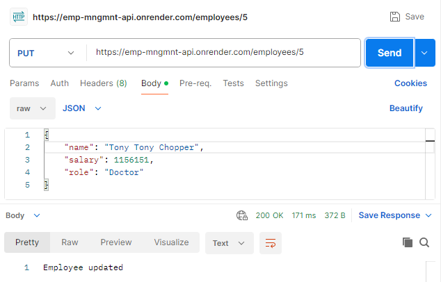
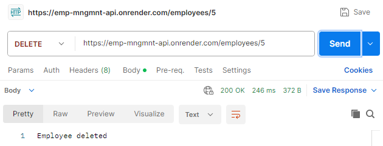

# 📘 Employee Management API (Spring Boot + JPA + PostgreSQL)


A RESTful web service built using Spring Boot that demonstrates CRUD operations using **Spring Data JPA** with **Hibernate** and a **PostgreSQL** database.

---

## 🌐 Live Demo

🔗 https://emp-mngmnt-api.onrender.com/health

Try:
- `/employees`
- `/employees/{id}`
- `/employees/page?page=0&size=2`

> Note: The application may take a few seconds to respond on the first request due to free-tier cold starts.
---

## 📌 Features

* Create, Read, Update, Delete (CRUD) operations
* Uses Spring Data JPA with Hibernate
* Automatic ORM mapping between Java objects and database tables
* Repository-based data access
* Pagination and sorting support
* Cloud-hosted PostgreSQL database (Neon)
* Proper error handling with HTTP status responses
* Clean layered architecture (Controller → Service → Repository)

---

## ✨ JPA Features Demonstrated

- Entity Mapping (`@Entity`)
- Primary Key Generation (`@Id`, `@GeneratedValue`)
- Repository Pattern (`JpaRepository`)
- Pagination (`Pageable`, `PageRequest`)
- Sorting (`Sort`)
- Automatic SQL Generation via Hibernate

---

## 🚀 Tech Stack

* Java 17
* Spring Boot
* Spring Web
* Spring Data JPA
* Hibernate
* PostgreSQL
* Maven

---

## 🗂️ Project Structure

```
src/
 └── main/
     ├── java/com/employee/app/
     │   ├── controller                    # REST endpoints
     │   ├── service                       # Business logic
     │   ├── repository                    # Database access (JPA)
     │   ├── entity                        # DB entity
     │   └── EmployeeManagementApp.java    # Spring Boot entry point
     └── resources/
         └── application.properties        # Configuration file
```

---

## ⚙️ Database Setup

This project uses PostgreSQL (cloud-hosted or local).

### Create Table

> Hibernate can automatically create/update the table schema when the application starts.

```sql
CREATE TABLE employee (
    id SERIAL PRIMARY KEY,
    name VARCHAR(100),
    salary INT,
    role VARCHAR(50)
);
```

---

## 🔧 Configuration

Update `application.properties`:

```properties
# port for server
server.port=${PORT:8088}

# Database configuration
spring.datasource.url=jdbc:postgresql://${DB_HOST}/${DB_NAME}?sslmode=require
# sslmode=require is mandatory for Neon PostgreSQL

spring.datasource.username=${DB_USERNAME}
spring.datasource.password=${DB_PASSWORD}
spring.datasource.driver-class-name=org.postgresql.Driver

# JPA configuration
spring.jpa.database-platform=org.hibernate.dialect.PostgreSQLDialect
spring.jpa.hibernate.ddl-auto=update

spring.jpa.show-sql=true
spring.jpa.properties.hibernate.format_sql=true

```

---

## ▶️ Running the Application

### Using Maven Wrapper:

```bash
./mvnw spring-boot:run
```

Or:

```bash
mvn spring-boot:run
```

### Using Docker:

#### Build Docker Image

```bash
docker build -t employee-management-api .
```

#### Run Docker Container

```bash

docker run -p 8088:8088 \
-e DB_HOST=<host> \
-e DB_NAME=<database> \
-e DB_USERNAME=<username> \
-e DB_PASSWORD=<password> \
employee-management-api
```

---

## 🌐 API Endpoints

| Method | Endpoint | Description |
|--------|----------|------------|
| POST   | `/employees` | Create a new employee |
| GET    | `/employees` | Get all employees |
| GET    | `/employees/{id}` | Get employee by ID |
| GET    | `/employees/page?page=0&size=2` | Get employees with Pagination |
| PUT    | `/employees/{id}` | Update employee |
| DELETE | `/employees/{id}` | Delete employee |

---

### 📌 Sample Request

```json
{
  "name": "Vinsmoke Sanji",
  "salary": 1989679,
  "role": "Cook"
}
```

### 📷 Sample Response

#### 📄 Get Employees



#### 🔍 Get Employees By ID



#### 📄 Get Employees Page



#### 📄 Empty Page



#### ➕ Create Employee



#### ✏️ Update Employee



#### ❌ Delete Employee



---

## ⚠️ Error Handling

* Returns meaningful messages when:

  * Employee ID does not exist

* Uses HTTP status codes:

  * `200 OK`
  * `404 Not Found`

---

## 📮 Testing

You can test APIs using:

* Browser (GET endpoints)
* Postman for full CRUD operations

---

## 🚀 Deployment

* Containerized using Docker
* Backend hosted on Render
* Database hosted on Neon PostgreSQL
* Environment-variable based configuration

---

## 📌 Note

This project is implemented using **Spring Data JPA** and **Hibernate** to demonstrate ORM concepts, repository-based data access, and modern Spring Boot development practices.
